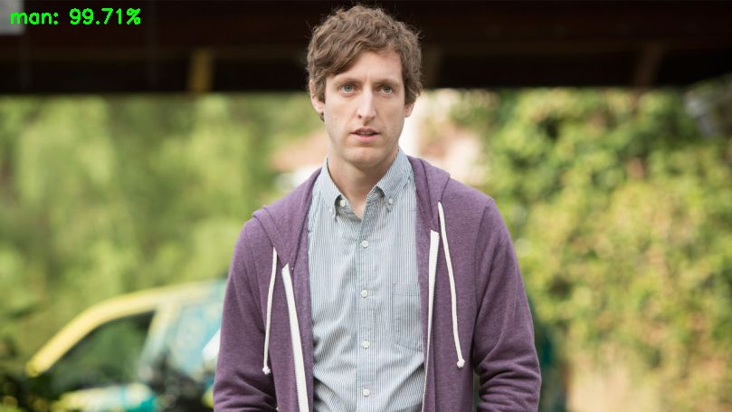
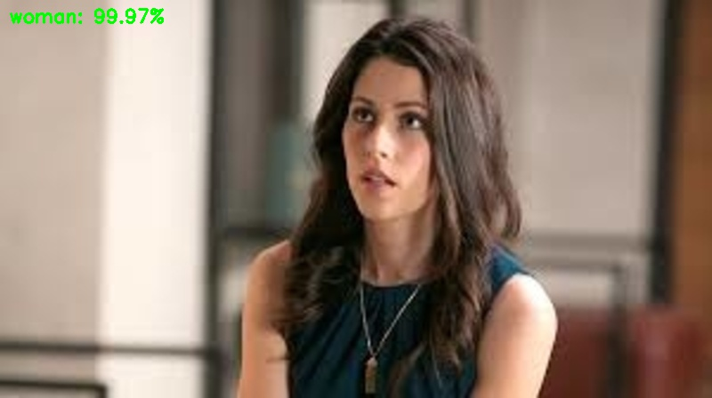

# Gender classification (from scratch) using deep learning with Keras
The keras model is created by training SmallerVGGNet from scratch on around 2200 images (~1100 for each class) gathered from Google Images. It acheived around 95% training accuracy and ~85% validation accuracy. (20% of the dataset is used for validation)

## Python packages
* numpy
* opencv-python
* tensorflow
* keras

Install the required packages by executing the following command.

`$ pip install -r requirements.txt`

**Note: This repo works on Python 3.x** 

## Usage
`$ python classify_gender.py -i <input_image> -m gender_classification.model`

## Sample output

## Contact
Feel free to create a new issue or reach out on twitter [@ponnusamy_arun](https://twitter.com/ponnusamy_arun).
